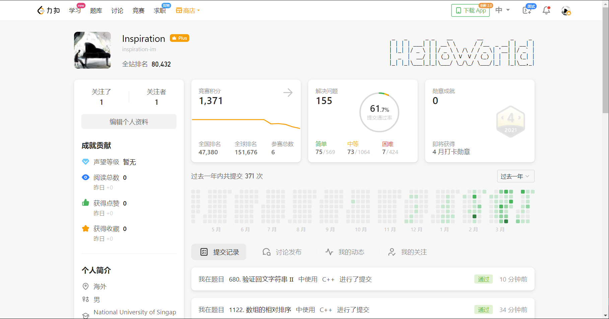

# Summary

（最近都除了笔试面试，还要准备考试，之后会完善总结，补充点干货）

## 感想
### 起因
当时报这门课程的时候，主要就是想提升自己的刷题能力，不再惧怕刷题。因为其实之前没有系统的学习过数据结构和算法，对里面的很多概念都不熟悉。所以挺怕做题的，属于完全没有思路那种，或者是即使有思路，也没办法实现。知道要刷题，但是不知道该从哪里开始刷。

### 过程
最开始的3-4个星期，每个星期就是跟着老师的视频走，看完视频之后就做视频下面的题目。尽量用五毒法（其实完成度并不是很好），大部分题都只刷了一遍。不过每个题刷完之后，都会去国际站看优秀的代码，觉得这种方法其实对提升代码能力有很大帮助。能知道很多trick，我觉得往往就是这些trick，往往就能反应你对一门语言的掌握程度以及编程能力。不过后面到dp之后感觉难度一下子上来了，记得有一天写了一天的dp，但是收效甚微，而且写的自己还有点恶心。之后再加上笔试面试，其实更多是去准备面试的东西了，刷题方面就有些怠慢。

### 结果
感觉进步还是挺大的，现在起码不怕写题了。虽然有的时候不会写（特别是dp），但是有思路的时候，基本都能将自己的思路给用代码写出来。三月份应该是刷了100+。还记得当时第一次看到自己得全站排名不是10w+时候，很开心，觉得自己终于有排名了哈哈哈哈，继续努力！
